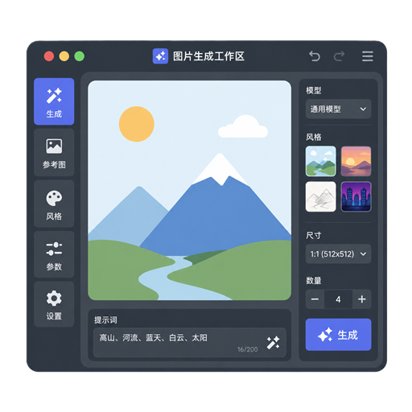

<p align="center">
  
</p>

<h1 align="center">Stroke</h1>
<p align="center">
  <strong>Swift strokes, infinite creations. &nbsp;一笔即画，创意无限。</strong>
</p>

<p align="center">
  <a href="https://github.com/TheSatchel/Stroke/actions"></a>
  <a href="https://github.com/TheSatchel/Stroke/blob/master/LICENSE"></a>
  <a href="https://github.com/TheSatchel/Stroke/releases"></a>
  <a href="https://www.python.org/"></a>
  <a href="https://fastapi.tiangolo.com/"></a>
  <a href="https://developer.mozilla.org/en-US/docs/Web/Progressive_web_apps"></a>
  <a href="https://github.com/TheSatchel/Stroke/stargazers"></a>
</p>

---

## 概述 / Overview

**Stroke** 是一个 **AI 图像生成工作区**，将可拖拽排序的配置面板、套索标注与多版本历史回溯融为一体。
你可以像在画布上"画圈"一样框选区域，添加区域性提示词；所有生成参数均通过可视化的 config-tab 体系管理，并可由用户**当场设计**自定义字段。

### 核心亮点

- 🎨 **画布套索** — 拖拽圈选，即时标注区域 prompt
- 🧩 **参数化配置面板** — 文本 · 拉杆 · 下拉 · 开关 · 单选 · 参考图上传，全部可拖拽排序与增删
- 📜 **多版本历史** — 每次生成存储多个微调版本，左栏滑块快速切换
- 🌗 **跟随系统的深色主题** — 明暗自适应，accent 色系统覆盖所有组件
- 📱 **PWA 支持** — 可安装到桌面，离线有基础承载页
- ⚡ **双模式部署** — ASGI（uvicorn）或 WSGI（waitress），Windows / Linux 通用

---

## 快速开始 / Quick Start

### 环境要求

- Python **3.10** 或更高版本
- pip（已包含在 Python 中）

### 安装与运行

```bash
# 克隆仓库
git clone https://github.com/TheSatchel/Stroke.git
cd stroke

# 创建虚拟环境（推荐）
python -m venv .venv

# 激活虚拟环境
.venv\Scripts\activate     # Windows
source .venv/bin/activate   # Linux / macOS

# 安装依赖
pip install -r requirements.txt

# 启动开发服务器（单 worker，自动重载）
python serve.py --debug
```

启动后访问 `http://127.0.0.1:8000`。

其他启动方式：

```bash
python serve.py --asgi       # ASGI 生产模式 (uvicorn)
python serve.py --wsgi       # WSGI 模式 (waitress，Windows 友好)
```

---

## 项目结构 / Project Structure

```
stroke/
├── app/
│   ├── __init__.py              # FastAPI 应用工厂
│   ├── config.py                # YAML 配置加载器
│   ├── templates.py             # Jinja2 模板初始化
│   └── routes/                  # 动态路由发现
│       ├── home.py              # 首页 SSR
│       ├── manifest.py          # PWA manifest 端点
│       ├── service_worker.py    # SW 脚本端点
│       └── health.py            # 健康检查
├── static/
│   ├── js/
│   │   ├── main.js              # 入口
│   │   ├── uis.js               # 模块打包（ESM）
│   │   ├── storage.js           # localStorage 抽象
│   │   ├── pwa.js               # PWA 注册
│   │   ├── workspace.js         # 工作区协调
│   │   └── components/
│   │       ├── App.js           # 根协调器
│   │       ├── Canvas.js        # 画布 & 套索
│   │       ├── ConfigPanel.js   # 配置面板（拖拽/增删）
│   │       ├── ConfigTabs.js    # Tab 总管 & prompt 拼接
│   │       ├── HistoryPanel.js  # 历史版本列表
│   │       ├── SettingsModal.js # API 设置 & 主题
│   │       └── widgets/         # 控件实现
│   │           ├── TextWidget.js
│   │           ├── SliderWidget.js
│   │           ├── ChoiceWidget.js
│   │           └── ImageWidget.js
│   ├── css/
│   │   └── workspace.css
│   └── img/                     # PWA 图标
├── templates/
│   └── index.html               # Jinja2 主模板
├── settings.yaml                # 应用 & PWA 配置
├── serve.py                     # 生产服务器入口
├── requirements.txt
└── README.md
```

---

## 配置 / Settings

编辑 `settings.yaml` 即可调整应用名称、PWA 元数据、服务端口等：

```yaml
app:
  name: "Stroke"
  version: "0.1.0"
  debug: true

server:
  host: "127.0.0.1"
  port: 8000
  workers: 4

pwa:
  name: "Stroke"
  short_name: "Stroke"
  description: "..."
  theme_color: "#000000"
  background_color: "#000000"
  display: "standalone"
  # ...
```

---

## 技术栈 / Tech Stack

| 层级 | 技术 |
|------|------|
| 后端框架 | [FastAPI](https://fastapi.tiangolo.com/) |
| 模板引擎 | [Jinja2](https://jinja.palletsprojects.com/) |
| ASGI 服务器 | [Uvicorn](https://www.uvicorn.org/) |
| WSGI 服务器 | [Waitress](https://docs.pylonsproject.org/projects/waitress/) + [a2wsgi](https://github.com/abersheeran/a2wsgi) |
| 前端 | Vanilla JS（ESM，零构建工具） |
| PWA | Service Worker + Web App Manifest |
| 配置 | YAML + 环境变量覆盖 |

---

## 许可 / License

[GNU General Public License v2.0](LICENSE) — 你可以自由使用、修改和分发本项目，但必须保持开源并沿用相同许可证。
